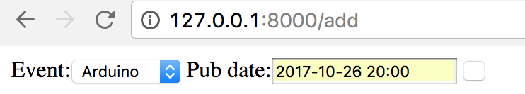
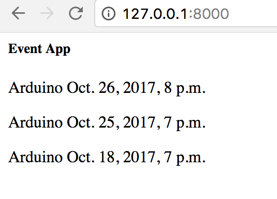

#### Objective:
Make form for multiple events

__tools:__
- formset
- jquery

**packages:**  
- [https://github.com/elo80ka/django-dynamic-formset](https://github.com/elo80ka/django-dynamic-formset)  
^ [Installation doc](https://github.com/elo80ka/django-dynamic-formset/blob/master/docs/usage.rst)

**resources:**  
- The very first >> Doc [https://docs.djangoproject.com/en/1.8/topics/forms/formsets/](https://docs.djangoproject.com/en/1.8/topics/forms/formsets/)
-
- [https://medium.com/@adandan01/django-inline-formsets-example-mybook-420cc4b6225d](https://medium.com/@adandan01/django-inline-formsets-example-mybook-420cc4b6225d)
-
- [https://godjango.com/9-forms-part-4-formsets/](https://godjango.com/9-forms-part-4-formsets/)

**conversations:**

[https://stackoverflow.com/questions/298779/form-or-formset-to-handle-multiple-table-rows-in-django](https://stackoverflow.com/questions/298779/form-or-formset-to-handle-multiple-table-rows-in-django)

---
<kbd>6 Oct 2017</kbd>

Looks reasonable to go [django-dynamic-formset](https://github.com/elo80ka/django-dynamic-formset) with Dj==1.8 and if it doesn't work, then go Medium and GoDjango links hack all logic by myself

    Step1:  Recover knowledge of forms  
          - make simple model form    
          - validate it  (optional)
    Step2:  Formset  
          - go through doc examples  
          - diff formset and inline formset  
          - make working formset for my Event  

    Step3:  django-dynamic-formset
          - Try it with his examples
          - Search for bugs common in my usecases
          - Change his demo to my models
          - Install his code on new project
          - If all work install on SzMakers

---
Step1  

<kbd>make simple model form</kbd>  
**simple**  
http://blog.appliedinformaticsinc.com/using-django-modelform-a-quick-guide/  
**more complicated**  
https://www.pydanny.com/core-concepts-django-modelforms.html  

works
form  

result  
  

##### Done here. Checkout to new branch for Step2

---

### Step2
